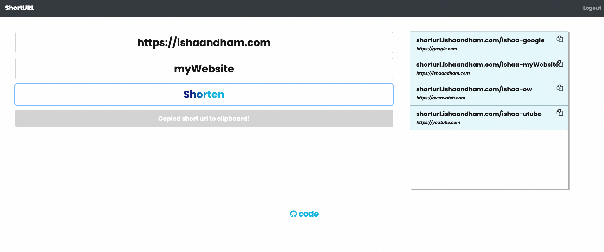

# urlShortner

`urlShortner` - An application that supports creation of personalized short urls.

Contents
========

 * [Why?](#why)
 * [Usage](#usage)
 * [Components](#components)
 * [Installation](#installation)
 * [Want to contribute?](#want-to-contribute)

### Why?

Most of the url shortner applications available online do not allow you to create custom short urls without buying a subscription. This motivated me to create a backend that allows users to create an account and manage their custom urls.

I created a public version (see Usage) for this service, and also added Dockerfiles and k8s manifests to allow self-hosting.

### Usage

There is a public web app available for use - [short url](https://shorturl.ishaandham.com/app/)

### Components

The app is simplistic, and only serves to provide the user the ability to create and manage their custom short urls. Most of the effort has gone into making the app scalable, and easy to host as uncoupled microservices.

1. Backend - A REST Api written in golang using Gorilla for routing. The REST Api can easily be scaled when hosting using a load balancer.
2. Frontend - The frontend [Frontend repo](https://github.com/Ishaandham19/urlShortnerUI) is written is React.js and is uncoupled from the backend service
3. Database - The backend connects to a postgres database, and uses `gorm` as a ORM library. I chose a relational database to ensure fast reads, and created indexes on `username` and `alias`.

### Installation/Deployment
---
1. Docker - Both the backend and frontend have Dockerfiles. Make sure to change environment variables as needed.

2. Kubernetes - I have created a repository that contains k8s manifests to host this app on a cluster. This a great way to deploy the app to ensure scalability. The k8s files currently lack manifests for a persistent store.

### Want to Contribute?
---

Make Pull Requests!
